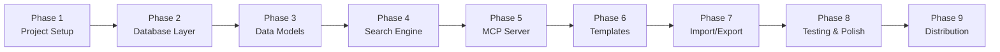

# 🏗️ OpenBlocks — Implementation Guide

**Version:** 1.0
**Date:** 2026-06-30

> A step-by-step guide to building OpenBlocks from zero to production.

---

## Implementation Overview



**Key dependency rule:** Each phase builds on the previous. Do NOT skip ahead.

---

## Phase 1: Project Setup

### 1.1 Initialize the Project

```bash
cd /home/aswin/programming/vscode/myProjects/ai_agent_tools/openblocks
cargo init --name openblocks
```

### 1.2 Cargo.toml

```toml
[package]
name = "openblocks"
version = "0.1.0"
edition = "2024"
description = "A Rust-native MCP server for web development — pre-built UI components, blocks, and templates for AI agents"
license = "MIT"
repository = "https://github.com/yourusername/openblocks"
keywords = ["mcp", "web-development", "ui-components", "ai-tools"]
categories = ["development-tools", "web-programming"]

[dependencies]
# MCP Core
rmcp = { version = "0.16", features = ["server", "transport-io", "macros"] }
tokio = { version = "1", features = ["full"] }

# Serialization
serde = { version = "1", features = ["derive"] }
serde_json = "1"
schemars = "0.8"

# Storage
rusqlite = { version = "0.33", features = ["bundled"] }
rusqlite_migration = "1"

# Search
simsearch = "0.2"

# Templating
minijinja = "2"

# Utilities
tracing = "0.1"
tracing-subscriber = { version = "0.3", features = ["env-filter"] }
uuid = { version = "1", features = ["v4", "serde"] }
chrono = { version = "0.4", features = ["serde"] }
thiserror = "2"
anyhow = "1"
dirs = "6"
clap = { version = "4", features = ["derive"] }

[profile.release]
opt-level = "z"       # Optimize for size
lto = true            # Link-time optimization
codegen-units = 1     # Single codegen unit for max optimization
strip = true          # Strip debug symbols
panic = "abort"       # Abort on panic (smaller binary)
```

### 1.3 Directory Structure

```bash
mkdir -p src/{db,models,search}
mkdir -p data tests docs
```

Create the file skeleton:

```
src/
├── main.rs             # Entry point
├── server.rs           # MCP server
├── config.rs           # Configuration
├── error.rs            # Error types
├── db/
│   ├── mod.rs          # DB module
│   ├── connection.rs   # SQLite setup
│   ├── migrations.rs   # Schema migrations
│   ├── components.rs   # Component CRUD
│   └── templates.rs    # Template CRUD
├── models/
│   ├── mod.rs          # Model exports
│   ├── component.rs    # Component structs
│   ├── template.rs     # Template structs
│   └── enums.rs        # Category, Framework
└── search/
    ├── mod.rs           # Search module
    └── engine.rs        # SimSearch wrapper
```

### 1.4 Main Entry Point

**`src/main.rs`**

```rust
use anyhow::Result;
use clap::{Parser, Subcommand};
use tracing_subscriber::{fmt, EnvFilter};

mod config;
mod db;
mod error;
mod models;
mod search;
mod server;

#[derive(Parser)]
#[command(name = "openblocks")]
#[command(about = "A Rust-native MCP server for web development")]
#[command(version)]
struct Cli {
    /// Path to SQLite database
    #[arg(long, env = "OPENBLOCKS_DB_PATH")]
    db_path: Option<String>,

    /// Log level (error, warn, info, debug, trace)
    #[arg(long, default_value = "info", env = "OPENBLOCKS_LOG_LEVEL")]
    log_level: String,

    #[command(subcommand)]
    command: Option<Commands>,
}

#[derive(Subcommand)]
enum Commands {
    /// Start the MCP server (default)
    Serve,
    /// Seed the database with starter components
    Seed,
    /// Show library statistics
    Stats,
}

#[tokio::main]
async fn main() -> Result<()> {
    let cli = Cli::parse();

    // CRITICAL: Log to stderr ONLY — stdout is the MCP JSON-RPC channel
    let filter = EnvFilter::try_from_default_env()
        .unwrap_or_else(|_| EnvFilter::new(&cli.log_level));

    fmt()
        .with_env_filter(filter)
        .with_writer(std::io::stderr)  // NEVER use stdout
        .init();

    tracing::info!("OpenBlocks v{}", env!("CARGO_PKG_VERSION"));

    // Determine database path
    let db_path = cli.db_path.unwrap_or_else(|| {
        let data_dir = dirs::data_dir()
            .unwrap_or_else(|| std::path::PathBuf::from("."))
            .join("openblocks");
        std::fs::create_dir_all(&data_dir).ok();
        data_dir.join("openblocks.db").to_string_lossy().to_string()
    });

    tracing::info!("Database: {}", db_path);

    // Initialize database
    let db = db::Database::new(&db_path)?;
    db.run_migrations()?;

    // Build search index
    let components = db.list_all_components()?;
    let mut search_engine = search::SearchEngine::new();
    search_engine.rebuild(&components);

    tracing::info!("Loaded {} components into search index", components.len());

    match cli.command.unwrap_or(Commands::Serve) {
        Commands::Serve => {
            tracing::info!("Starting MCP server on stdio transport...");
            let server = server::OpenBlocksServer::new(db, search_engine);
            // Serve via stdio — blocks until client disconnects
            server.serve().await?;
        }
        Commands::Seed => {
            tracing::info!("Seeding database with starter components...");
            let count = db.seed_from_file("data/seed_components.json")?;
            eprintln!("Seeded {} components", count);
        }
        Commands::Stats => {
            let stats = db.get_stats()?;
            eprintln!("OpenBlocks Library Statistics:");
            eprintln!("  Components: {}", stats.total_components);
            eprintln!("  Templates:  {}", stats.total_templates);
            eprintln!("  Categories: {}", stats.categories.len());
            eprintln!("  Frameworks: {}", stats.frameworks.len());
        }
    }

    Ok(())
}
```

### 1.5 Error Types

**`src/error.rs`**

```rust
use thiserror::Error;

#[derive(Error, Debug)]
pub enum OpenBlocksError {
    #[error("Component not found: {0}")]
    ComponentNotFound(String),

    #[error("Template not found: {0}")]
    TemplateNotFound(String),

    #[error("Invalid category: '{0}'. Valid: navbar, hero, footer, sidebar, card, form, modal, table, pricing, testimonial, cta, feature, faq, contact, auth, dashboard, settings, profile, landing, blog, ecommerce, error, loading, notification, section, other")]
    InvalidCategory(String),

    #[error("Invalid framework: '{0}'. Valid: tailwind, css, scss, shadcn")]
    InvalidFramework(String),

    #[error("Validation error: {0}")]
    Validation(String),

    #[error("Database error: {0}")]
    Database(#[from] rusqlite::Error),

    #[error("JSON error: {0}")]
    Json(#[from] serde_json::Error),

    #[error("IO error: {0}")]
    Io(#[from] std::io::Error),

    #[error("Import error: {0}")]
    Import(String),

    #[error("Template render error: {0}")]
    Render(String),
}

pub type Result<T> = std::result::Result<T, OpenBlocksError>;
```

### ✅ Phase 1 Checkpoint
Run `cargo build` — it should compile with empty module stubs. No functionality yet, just the skeleton.

---

## Phase 2: Database Layer

### 2.1 Connection Setup

**`src/db/connection.rs`**

```rust
use rusqlite::Connection;
use std::path::Path;

pub fn open_connection(db_path: &str) -> rusqlite::Result<Connection> {
    let conn = if db_path == ":memory:" {
        Connection::open_in_memory()?
    } else {
        // Ensure parent directory exists
        if let Some(parent) = Path::new(db_path).parent() {
            std::fs::create_dir_all(parent).ok();
        }
        Connection::open(db_path)?
    };

    // Enable WAL mode for concurrent read/write
    conn.pragma_update(None, "journal_mode", "WAL")?;
    // Enable foreign keys
    conn.pragma_update(None, "foreign_keys", "ON")?;

    Ok(conn)
}
```

### 2.2 Migrations

**`src/db/migrations.rs`**

```rust
use rusqlite_migration::{Migrations, M};

pub fn get_migrations() -> Migrations<'static> {
    Migrations::new(vec![
        // Migration 1: Initial schema
        M::up(r#"
            CREATE TABLE IF NOT EXISTS components (
                id              TEXT PRIMARY KEY NOT NULL,
                name            TEXT NOT NULL,
                description     TEXT NOT NULL,
                category        TEXT NOT NULL,
                framework       TEXT NOT NULL,
                code            TEXT NOT NULL,
                dependencies    TEXT NOT NULL DEFAULT '[]',
                tags            TEXT NOT NULL DEFAULT '[]',
                preview_html    TEXT,
                version         INTEGER NOT NULL DEFAULT 1,
                created_at      TEXT NOT NULL,
                updated_at      TEXT NOT NULL
            );

            CREATE TABLE IF NOT EXISTS component_versions (
                id              TEXT PRIMARY KEY NOT NULL,
                component_id    TEXT NOT NULL,
                version         INTEGER NOT NULL,
                code            TEXT NOT NULL,
                description     TEXT,
                created_at      TEXT NOT NULL,
                FOREIGN KEY (component_id) REFERENCES components(id) ON DELETE CASCADE
            );

            CREATE TABLE IF NOT EXISTS templates (
                id              TEXT PRIMARY KEY NOT NULL,
                name            TEXT NOT NULL,
                description     TEXT NOT NULL,
                layout          TEXT NOT NULL DEFAULT '{}',
                component_ids   TEXT NOT NULL DEFAULT '[]',
                variables       TEXT NOT NULL DEFAULT '{}',
                created_at      TEXT NOT NULL,
                updated_at      TEXT NOT NULL
            );

            CREATE INDEX IF NOT EXISTS idx_components_category ON components(category);
            CREATE INDEX IF NOT EXISTS idx_components_framework ON components(framework);
            CREATE INDEX IF NOT EXISTS idx_components_name ON components(name);
            CREATE INDEX IF NOT EXISTS idx_components_updated ON components(updated_at);
            CREATE INDEX IF NOT EXISTS idx_component_versions_cid ON component_versions(component_id);
            CREATE INDEX IF NOT EXISTS idx_templates_name ON templates(name);
        "#),
    ])
}
```

### 2.3 Component CRUD Operations

**`src/db/components.rs`**

```rust
use crate::error::{OpenBlocksError, Result};
use crate::models::component::{Component, NewComponent, UpdateComponent};
use chrono::Utc;
use rusqlite::{params, Connection};
use uuid::Uuid;

/// Insert a new component into the database
pub fn insert_component(conn: &Connection, new: &NewComponent) -> Result<Component> {
    let id = Uuid::new_v4();
    let now = Utc::now().to_rfc3339();
    let deps_json = serde_json::to_string(&new.dependencies)?;
    let tags_json = serde_json::to_string(&new.tags)?;

    conn.execute(
        r#"INSERT INTO components
           (id, name, description, category, framework, code, dependencies, tags, version, created_at, updated_at)
           VALUES (?1, ?2, ?3, ?4, ?5, ?6, ?7, ?8, 1, ?9, ?10)"#,
        params![
            id.to_string(),
            new.name,
            new.description,
            new.category,
            new.framework,
            new.code,
            deps_json,
            tags_json,
            now,
            now,
        ],
    )?;

    get_component_by_id(conn, &id.to_string())
}

/// Get a single component by ID
pub fn get_component_by_id(conn: &Connection, id: &str) -> Result<Component> {
    let mut stmt = conn.prepare(
        "SELECT id, name, description, category, framework, code, dependencies, tags, preview_html, version, created_at, updated_at
         FROM components WHERE id = ?1"
    )?;

    let component = stmt.query_row(params![id], |row| {
        Ok(Component {
            id: row.get::<_, String>(0)?.parse().unwrap_or_default(),
            name: row.get(1)?,
            description: row.get(2)?,
            category: row.get::<_, String>(3)?.parse().unwrap_or_default(),
            framework: row.get::<_, String>(4)?.parse().unwrap_or_default(),
            code: row.get(5)?,
            dependencies: serde_json::from_str(&row.get::<_, String>(6)?).unwrap_or_default(),
            tags: serde_json::from_str(&row.get::<_, String>(7)?).unwrap_or_default(),
            preview_html: row.get(8)?,
            version: row.get(9)?,
            created_at: row.get::<_, String>(10)?.parse().unwrap_or_default(),
            updated_at: row.get::<_, String>(11)?.parse().unwrap_or_default(),
        })
    }).map_err(|_| OpenBlocksError::ComponentNotFound(id.to_string()))?;

    Ok(component)
}

/// Update an existing component (partial update)
pub fn update_component(conn: &Connection, update: &UpdateComponent) -> Result<Component> {
    // First verify component exists
    let existing = get_component_by_id(conn, &update.id)?;

    // Save current version to history
    let version_id = Uuid::new_v4();
    let now = Utc::now().to_rfc3339();

    conn.execute(
        r#"INSERT INTO component_versions (id, component_id, version, code, created_at)
           VALUES (?1, ?2, ?3, ?4, ?5)"#,
        params![
            version_id.to_string(),
            update.id,
            existing.version,
            existing.code,
            now,
        ],
    )?;

    // Build dynamic UPDATE query
    let new_version = existing.version + 1;
    let name = update.name.as_deref().unwrap_or(&existing.name);
    let description = update.description.as_deref().unwrap_or(&existing.description);
    let code = update.code.as_deref().unwrap_or(&existing.code);
    let category = update.category.as_deref()
        .unwrap_or(&existing.category.to_string());
    let framework = update.framework.as_deref()
        .unwrap_or(&existing.framework.to_string());

    let tags = match &update.tags {
        Some(t) => serde_json::to_string(t)?,
        None => serde_json::to_string(&existing.tags)?,
    };
    let deps = match &update.dependencies {
        Some(d) => serde_json::to_string(d)?,
        None => serde_json::to_string(&existing.dependencies)?,
    };

    conn.execute(
        r#"UPDATE components SET
           name = ?1, description = ?2, code = ?3, category = ?4, framework = ?5,
           tags = ?6, dependencies = ?7, version = ?8, updated_at = ?9
           WHERE id = ?10"#,
        params![name, description, code, category, framework, tags, deps, new_version, now, update.id],
    )?;

    get_component_by_id(conn, &update.id)
}

/// Delete a component by ID
pub fn delete_component(conn: &Connection, id: &str) -> Result<()> {
    // Verify it exists first
    let _ = get_component_by_id(conn, id)?;

    conn.execute("DELETE FROM components WHERE id = ?1", params![id])?;
    Ok(())
}

/// List components with optional filters
pub fn list_components(
    conn: &Connection,
    category: Option<&str>,
    framework: Option<&str>,
    limit: usize,
) -> Result<Vec<Component>> {
    let mut sql = String::from(
        "SELECT id, name, description, category, framework, code, dependencies, tags, preview_html, version, created_at, updated_at
         FROM components WHERE 1=1"
    );
    let mut param_values: Vec<Box<dyn rusqlite::types::ToSql>> = Vec::new();

    if let Some(cat) = category {
        sql.push_str(&format!(" AND category = ?{}", param_values.len() + 1));
        param_values.push(Box::new(cat.to_string()));
    }
    if let Some(fw) = framework {
        sql.push_str(&format!(" AND framework = ?{}", param_values.len() + 1));
        param_values.push(Box::new(fw.to_string()));
    }

    sql.push_str(&format!(" ORDER BY updated_at DESC LIMIT {}", limit));

    let mut stmt = conn.prepare(&sql)?;
    let params: Vec<&dyn rusqlite::types::ToSql> = param_values.iter()
        .map(|p| p.as_ref())
        .collect();

    let rows = stmt.query_map(params.as_slice(), |row| {
        Ok(Component {
            id: row.get::<_, String>(0)?.parse().unwrap_or_default(),
            name: row.get(1)?,
            description: row.get(2)?,
            category: row.get::<_, String>(3)?.parse().unwrap_or_default(),
            framework: row.get::<_, String>(4)?.parse().unwrap_or_default(),
            code: row.get(5)?,
            dependencies: serde_json::from_str(&row.get::<_, String>(6)?).unwrap_or_default(),
            tags: serde_json::from_str(&row.get::<_, String>(7)?).unwrap_or_default(),
            preview_html: row.get(8)?,
            version: row.get(9)?,
            created_at: row.get::<_, String>(10)?.parse().unwrap_or_default(),
            updated_at: row.get::<_, String>(11)?.parse().unwrap_or_default(),
        })
    })?;

    let components: Vec<Component> = rows.filter_map(|r| r.ok()).collect();
    Ok(components)
}

/// List all components (for building search index)
pub fn list_all_components(conn: &Connection) -> Result<Vec<Component>> {
    list_components(conn, None, None, usize::MAX)
}
```

### ✅ Phase 2 Checkpoint
Write a test that creates an in-memory DB, runs migrations, inserts a component, retrieves it, updates it, and deletes it. All should pass.

---

## Phase 3: Data Models

See `spec.md` Section 4 for complete model definitions. Key implementation notes:

### 3.1 FromStr for Enums

The `Category` and `Framework` enums need `FromStr` to convert database string values back to Rust enums. Use serde's rename_all for lowercase serialization.

### 3.2 Validation

**`src/models/component.rs`** — add validation method:

```rust
impl NewComponent {
    pub fn validate(&self) -> Result<()> {
        if self.name.is_empty() || self.name.len() > 200 {
            return Err(OpenBlocksError::Validation(
                "Name must be 1-200 characters".into()
            ));
        }
        if self.description.is_empty() || self.description.len() > 2000 {
            return Err(OpenBlocksError::Validation(
                "Description must be 1-2000 characters".into()
            ));
        }
        if self.code.is_empty() {
            return Err(OpenBlocksError::Validation(
                "Code cannot be empty".into()
            ));
        }
        if self.tags.is_empty() {
            return Err(OpenBlocksError::Validation(
                "At least one tag is required".into()
            ));
        }
        // Validate category and framework parse correctly
        self.category.parse::<Category>()
            .map_err(|_| OpenBlocksError::InvalidCategory(self.category.clone()))?;
        self.framework.parse::<Framework>()
            .map_err(|_| OpenBlocksError::InvalidFramework(self.framework.clone()))?;
        Ok(())
    }
}
```

### ✅ Phase 3 Checkpoint
All model structs compile, enum conversions work, validation catches bad inputs.

---

## Phase 4: Search Engine

**`src/search/engine.rs`**

```rust
use crate::models::component::Component;
use simsearch::SimSearch;
use uuid::Uuid;

pub struct SearchEngine {
    index: SimSearch<Uuid>,
}

impl SearchEngine {
    pub fn new() -> Self {
        Self {
            index: SimSearch::new(),
        }
    }

    /// Add a single component to the index
    pub fn index_component(&mut self, component: &Component) {
        let searchable = format!(
            "{} {} {}",
            component.name,
            component.description,
            component.tags.join(" ")
        );
        self.index.insert(component.id, &searchable);
    }

    /// Remove a component from the index by rebuilding without it
    /// (SimSearch doesn't support individual removal)
    pub fn remove_component(&mut self, components: &[Component], remove_id: &Uuid) {
        self.index = SimSearch::new();
        for c in components {
            if &c.id != remove_id {
                self.index_component(c);
            }
        }
    }

    /// Search for components matching a query
    pub fn search(&self, query: &str) -> Vec<Uuid> {
        if query.trim().is_empty() {
            return vec![];
        }
        self.index.search(query)
    }

    /// Rebuild the entire index from a list of components
    pub fn rebuild(&mut self, components: &[Component]) {
        self.index = SimSearch::new();
        for component in components {
            self.index_component(component);
        }
        tracing::debug!("Search index rebuilt with {} components", components.len());
    }
}
```

### ✅ Phase 4 Checkpoint
Index 100 components, search for "dark navbar" — verify it returns relevant results in < 1ms.

---

## Phase 5: MCP Server Implementation

This is the core phase — wiring everything together with the MCP protocol.

**`src/server.rs`**

```rust
use crate::db::Database;
use crate::error::OpenBlocksError;
use crate::models::component::{NewComponent, UpdateComponent};
use crate::search::SearchEngine;
use rmcp::{tool, tool_router, Content, CallToolResult};
use schemars::JsonSchema;
use serde::{Deserialize, Serialize};
use std::sync::Mutex;

/// Shared state wrapped for interior mutability
pub struct OpenBlocksServer {
    db: Mutex<Database>,
    search: Mutex<SearchEngine>,
}

impl OpenBlocksServer {
    pub fn new(db: Database, search: SearchEngine) -> Self {
        Self {
            db: Mutex::new(db),
            search: Mutex::new(search),
        }
    }

    pub async fn serve(self) -> anyhow::Result<()> {
        // Serve using stdio transport
        rmcp::ServiceExt::serve(self, rmcp::transport::stdio()).await?;
        Ok(())
    }
}

// --- Input structs for MCP tools (need JsonSchema derive) ---

#[derive(Debug, Deserialize, JsonSchema)]
struct SearchInput {
    /// Search text (fuzzy matched against names, descriptions, and tags)
    query: String,
    /// Filter by category: navbar, hero, footer, card, form, modal, etc.
    category: Option<String>,
    /// Filter by framework: tailwind, css, scss, shadcn
    framework: Option<String>,
    /// Maximum results to return (default: 10)
    limit: Option<usize>,
}

#[derive(Debug, Deserialize, JsonSchema)]
struct GetInput {
    /// Component UUID
    id: String,
}

#[derive(Debug, Deserialize, JsonSchema)]
struct DeleteInput {
    /// Component UUID to delete
    id: String,
}

// --- MCP Tool Router ---

#[tool_router]
impl OpenBlocksServer {

    #[tool(description = "Search the UI component library. Fuzzy matches against component names, descriptions, and tags. Optionally filter by category (navbar, hero, footer, card, form, modal, pricing, etc.) and framework (tailwind, css, scss, shadcn). Returns component metadata (no code) — use get_component to retrieve code.")]
    async fn search_components(&self, input: SearchInput) -> CallToolResult {
        let limit = input.limit.unwrap_or(10);

        let search = self.search.lock().unwrap();
        let matching_ids = search.search(&input.query);
        drop(search);

        let db = self.db.lock().unwrap();
        let mut results = Vec::new();

        for id in matching_ids.into_iter().take(limit * 2) {
            if let Ok(component) = db.get_component(&id.to_string()) {
                // Apply filters
                if let Some(ref cat) = input.category {
                    if component.category.to_string() != *cat {
                        continue;
                    }
                }
                if let Some(ref fw) = input.framework {
                    if component.framework.to_string() != *fw {
                        continue;
                    }
                }
                results.push(serde_json::json!({
                    "id": component.id,
                    "name": component.name,
                    "description": component.description,
                    "category": component.category,
                    "framework": component.framework,
                    "tags": component.tags,
                    "version": component.version,
                }));
                if results.len() >= limit {
                    break;
                }
            }
        }

        let response = serde_json::json!({
            "results": results,
            "total": results.len(),
            "query": input.query,
        });

        CallToolResult::success(vec![Content::text(
            serde_json::to_string_pretty(&response).unwrap()
        )])
    }

    #[tool(description = "Get the full details and source code of a component by its ID. Use this after search_components to retrieve the actual code.")]
    async fn get_component(&self, input: GetInput) -> CallToolResult {
        let db = self.db.lock().unwrap();
        match db.get_component(&input.id) {
            Ok(component) => {
                let json = serde_json::to_string_pretty(&component).unwrap();
                CallToolResult::success(vec![Content::text(json)])
            }
            Err(e) => CallToolResult::error(vec![Content::text(e.to_string())]),
        }
    }

    #[tool(description = "Add a new UI component to the library. Provide name, description, category (navbar/hero/footer/card/form/modal/pricing/etc.), framework (tailwind/css/scss/shadcn), the HTML/CSS/JS code, and searchable tags.")]
    async fn add_component(&self, input: NewComponent) -> CallToolResult {
        // Validate input
        if let Err(e) = input.validate() {
            return CallToolResult::error(vec![Content::text(e.to_string())]);
        }

        let db = self.db.lock().unwrap();
        match db.insert_component(&input) {
            Ok(component) => {
                // Update search index
                drop(db);
                let mut search = self.search.lock().unwrap();
                search.index_component(&component);

                let response = serde_json::json!({
                    "id": component.id,
                    "name": component.name,
                    "version": component.version,
                    "message": "Component added successfully"
                });
                CallToolResult::success(vec![Content::text(
                    serde_json::to_string_pretty(&response).unwrap()
                )])
            }
            Err(e) => CallToolResult::error(vec![Content::text(e.to_string())]),
        }
    }

    #[tool(description = "Update an existing component. Provide the component ID and any fields to change (name, description, code, tags, category, framework). Unchanged fields keep their current values. Creates a version history entry.")]
    async fn update_component(&self, input: UpdateComponent) -> CallToolResult {
        let db = self.db.lock().unwrap();
        match db.update_component(&input) {
            Ok(component) => {
                // Rebuild search index for this component
                drop(db);
                let db = self.db.lock().unwrap();
                let all = db.list_all_components().unwrap_or_default();
                drop(db);
                let mut search = self.search.lock().unwrap();
                search.rebuild(&all);

                let response = serde_json::json!({
                    "id": component.id,
                    "name": component.name,
                    "version": component.version,
                    "message": "Component updated successfully"
                });
                CallToolResult::success(vec![Content::text(
                    serde_json::to_string_pretty(&response).unwrap()
                )])
            }
            Err(e) => CallToolResult::error(vec![Content::text(e.to_string())]),
        }
    }

    #[tool(description = "Delete a component from the library by its ID. This action is permanent.")]
    async fn delete_component(&self, input: DeleteInput) -> CallToolResult {
        let db = self.db.lock().unwrap();
        match db.delete_component(&input.id) {
            Ok(()) => {
                // Rebuild search index
                let all = db.list_all_components().unwrap_or_default();
                drop(db);
                let mut search = self.search.lock().unwrap();
                search.rebuild(&all);

                let response = serde_json::json!({
                    "id": input.id,
                    "message": "Component deleted successfully"
                });
                CallToolResult::success(vec![Content::text(
                    serde_json::to_string_pretty(&response).unwrap()
                )])
            }
            Err(e) => CallToolResult::error(vec![Content::text(e.to_string())]),
        }
    }

    #[tool(description = "List all available component categories with the count of components in each.")]
    async fn list_categories(&self) -> CallToolResult {
        let db = self.db.lock().unwrap();
        match db.get_category_counts() {
            Ok(counts) => {
                let json = serde_json::to_string_pretty(&counts).unwrap();
                CallToolResult::success(vec![Content::text(json)])
            }
            Err(e) => CallToolResult::error(vec![Content::text(e.to_string())]),
        }
    }

    #[tool(description = "List all supported CSS frameworks with the count of components in each.")]
    async fn list_frameworks(&self) -> CallToolResult {
        let db = self.db.lock().unwrap();
        match db.get_framework_counts() {
            Ok(counts) => {
                let json = serde_json::to_string_pretty(&counts).unwrap();
                CallToolResult::success(vec![Content::text(json)])
            }
            Err(e) => CallToolResult::error(vec![Content::text(e.to_string())]),
        }
    }

    #[tool(description = "Get library-wide statistics: total components, total templates, category breakdown, framework breakdown.")]
    async fn get_stats(&self) -> CallToolResult {
        let db = self.db.lock().unwrap();
        match db.get_stats() {
            Ok(stats) => {
                let json = serde_json::to_string_pretty(&stats).unwrap();
                CallToolResult::success(vec![Content::text(json)])
            }
            Err(e) => CallToolResult::error(vec![Content::text(e.to_string())]),
        }
    }
}
```

### ✅ Phase 5 Checkpoint
1. Run `cargo build` — everything compiles
2. Test with MCP Inspector: `npx @modelcontextprotocol/inspector ./target/debug/openblocks serve`
3. Call `add_component` → `search_components` → `get_component` — full cycle works

---

## Phase 6: Template Engine

### 6.1 Template Rendering with MiniJinja

```rust
use minijinja::{Environment, context};
use crate::models::template::Template;
use crate::db::Database;

pub fn scaffold_page(
    db: &Database,
    template: &Template,
    variables: &serde_json::Value,
) -> Result<String> {
    let mut env = Environment::new();

    // Load each component's code
    let mut sections = Vec::new();
    let component_ids: Vec<String> = serde_json::from_value(
        serde_json::Value::Array(
            template.component_ids.iter().map(|id| serde_json::Value::String(id.to_string())).collect()
        )
    ).unwrap_or_default();

    for id in &component_ids {
        let component = db.get_component(id)?;
        sections.push(component.code);
    }

    // Get or build the base template
    let base = template.layout.get("base_template")
        .and_then(|v| v.as_str())
        .unwrap_or("<!DOCTYPE html>\n<html>\n<body>\n{{ sections }}\n</body>\n</html>");

    env.add_template("page", base)
        .map_err(|e| OpenBlocksError::Render(e.to_string()))?;

    let tmpl = env.get_template("page")
        .map_err(|e| OpenBlocksError::Render(e.to_string()))?;

    let combined_sections = sections.join("\n\n");

    // Merge template variables with user-provided overrides
    let rendered = tmpl.render(context! {
        sections => combined_sections,
        ..variables.clone()
    }).map_err(|e| OpenBlocksError::Render(e.to_string()))?;

    Ok(rendered)
}
```

### ✅ Phase 6 Checkpoint
Create a template with 3 component IDs, scaffold it, verify the HTML output contains all three component codes.

---

## Phase 7: Import/Export

### 7.1 JSON Import

```rust
use std::fs;
use crate::models::component::NewComponent;

pub fn import_from_json(db: &Database, file_path: &str) -> Result<ImportResult> {
    let content = fs::read_to_string(file_path)
        .map_err(|e| OpenBlocksError::Import(format!("Cannot read file: {e}")))?;

    let components: Vec<NewComponent> = serde_json::from_str(&content)
        .map_err(|e| OpenBlocksError::Import(format!("Invalid JSON: {e}")))?;

    let mut imported = 0;
    let mut skipped = 0;
    let mut errors = Vec::new();

    for comp in &components {
        match comp.validate() {
            Ok(()) => {
                match db.insert_component(comp) {
                    Ok(_) => imported += 1,
                    Err(e) => {
                        errors.push(format!("{}: {}", comp.name, e));
                        skipped += 1;
                    }
                }
            }
            Err(e) => {
                errors.push(format!("{}: {}", comp.name, e));
                skipped += 1;
            }
        }
    }

    Ok(ImportResult { imported, skipped, errors })
}

#[derive(Serialize)]
pub struct ImportResult {
    pub imported: usize,
    pub skipped: usize,
    pub errors: Vec<String>,
}
```

### 7.2 JSON Export

```rust
pub fn export_to_json(
    db: &Database,
    output_path: &str,
    category: Option<&str>,
    framework: Option<&str>,
) -> Result<usize> {
    let components = db.list_components(category, framework, usize::MAX)?;
    let json = serde_json::to_string_pretty(&components)?;
    fs::write(output_path, json)?;
    Ok(components.len())
}
```

### ✅ Phase 7 Checkpoint
Export 10 components to JSON, wipe DB, import them back, verify count matches.

---

## Phase 8: Testing & Polish

### 8.1 Unit Test Pattern

```rust
#[cfg(test)]
mod tests {
    use super::*;

    fn setup_test_db() -> Database {
        let db = Database::new(":memory:").unwrap();
        db.run_migrations().unwrap();
        db
    }

    #[test]
    fn test_insert_and_get_component() {
        let db = setup_test_db();
        let new = NewComponent {
            name: "Test Navbar".into(),
            description: "A test navbar component".into(),
            category: "navbar".into(),
            framework: "tailwind".into(),
            code: "<nav>Test</nav>".into(),
            tags: vec!["test".into(), "navbar".into()],
            dependencies: vec![],
        };

        let inserted = db.insert_component(&new).unwrap();
        assert_eq!(inserted.name, "Test Navbar");
        assert_eq!(inserted.version, 1);

        let fetched = db.get_component(&inserted.id.to_string()).unwrap();
        assert_eq!(fetched.id, inserted.id);
        assert_eq!(fetched.code, "<nav>Test</nav>");
    }

    #[test]
    fn test_update_increments_version() {
        let db = setup_test_db();
        // ... insert, then update, verify version == 2
    }

    #[test]
    fn test_delete_removes_component() {
        let db = setup_test_db();
        // ... insert, delete, verify get returns error
    }

    #[test]
    fn test_search_finds_by_name() {
        let db = setup_test_db();
        let mut search = SearchEngine::new();
        // ... insert component, index it, search for it
    }
}
```

### 8.2 Integration Testing with MCP Inspector

```bash
# Build the server
cargo build

# Launch MCP Inspector pointing at your server
npx @modelcontextprotocol/inspector ./target/debug/openblocks serve

# In the Inspector UI:
# 1. Click "Tools" tab — verify all tools are listed
# 2. Call add_component with test data — verify success
# 3. Call search_components — verify the component appears
# 4. Call get_component with the returned ID — verify code is correct
# 5. Call update_component — verify version increments
# 6. Call delete_component — verify it's gone
# 7. Call get_stats — verify counts are correct
```

---

## Phase 9: Distribution

### 9.1 Release Build

```bash
# Optimized release build
cargo build --release

# Check binary size
ls -lh target/release/openblocks
# Expected: ~5-15MB

# Test the release binary
./target/release/openblocks --version
```

### 9.2 Cross-Compilation

```bash
# Install cross-compilation tool
cargo install cross

# Linux x86_64
cross build --release --target x86_64-unknown-linux-gnu

# macOS Apple Silicon
cross build --release --target aarch64-apple-darwin

# macOS Intel
cross build --release --target x86_64-apple-darwin

# Windows
cross build --release --target x86_64-pc-windows-msvc
```

### 9.3 Client Configuration

**Claude Desktop** (`~/Library/Application Support/Claude/claude_desktop_config.json`):
```json
{
  "mcpServers": {
    "openblocks": {
      "command": "/usr/local/bin/openblocks",
      "args": ["serve"]
    }
  }
}
```

**Cursor** (`.cursor/mcp.json` in project root):
```json
{
  "mcpServers": {
    "openblocks": {
      "command": "/usr/local/bin/openblocks",
      "args": ["serve"]
    }
  }
}
```

**VS Code + Cline** (`~/.config/cline/mcp_settings.json`):
```json
{
  "mcpServers": {
    "openblocks": {
      "command": "/usr/local/bin/openblocks",
      "args": ["serve"],
      "disabled": false
    }
  }
}
```

### ✅ Phase 9 Checkpoint
Binary runs on target platform, connects to at least one AI client, full tool cycle works.

---

## Code Patterns & Best Practices

### State Sharing

The server uses `Mutex<T>` for interior mutability since `rmcp` requires `&self` in tool methods:

```rust
pub struct OpenBlocksServer {
    db: Mutex<Database>,
    search: Mutex<SearchEngine>,
}
```

> **Why not `RwLock`?** For this use case, contention is extremely low (single AI agent making sequential calls). `Mutex` is simpler and sufficient.

### Logging Rules

```rust
// ✅ CORRECT — logs to stderr
tracing::info!("Component added: {}", name);
tracing::error!("Database error: {}", err);

// ❌ WRONG — corrupts MCP JSON-RPC stream
println!("Component added: {}", name);
```

### Error Propagation

```rust
// In tool handlers — convert errors to MCP error responses
match db.get_component(&id) {
    Ok(c) => CallToolResult::success(vec![Content::text(...)]),
    Err(e) => CallToolResult::error(vec![Content::text(e.to_string())]),
}

// In internal functions — use ? operator with thiserror
pub fn get_component(&self, id: &str) -> Result<Component> {
    let conn = self.conn.lock().map_err(|_|
        OpenBlocksError::Database(rusqlite::Error::InvalidQuery))?;
    // ... ?-propagation works naturally
}
```
