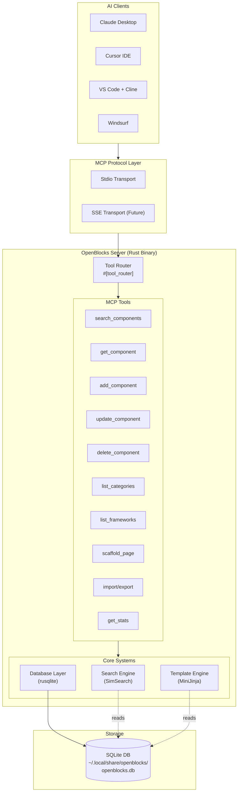
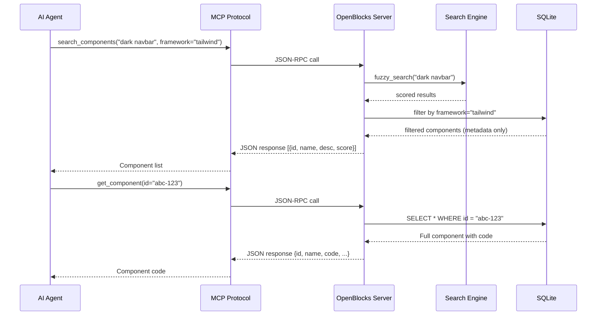
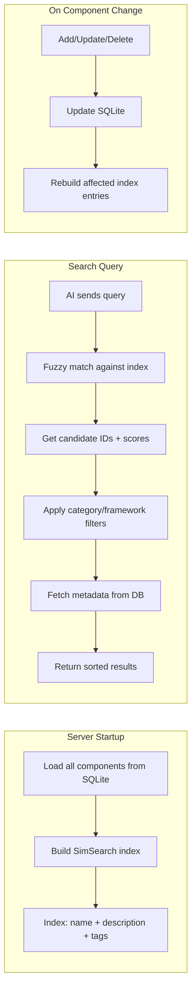
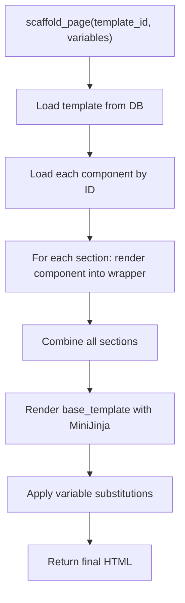

# 🔧 OpenBlocks — Technical Specification

**Version:** 1.0
**Date:** 2026-06-30
**Status:** Draft

---

## 1. System Overview

### Architecture Diagram



### Data Flow



---

## 2. Technology Stack

| Layer | Technology | Version | Purpose |
|---|---|---|---|
| **Language** | Rust | Edition 2024 | Core language |
| **MCP SDK** | `rmcp` | 0.16.x | MCP protocol implementation |
| **Async Runtime** | `tokio` | 1.x | Async I/O |
| **Database** | `rusqlite` | 0.33.x | SQLite bindings (with `bundled`) |
| **Migrations** | `rusqlite_migration` | 1.x | Schema versioning |
| **Serialization** | `serde` + `serde_json` | 1.x | JSON ser/de |
| **Schema Gen** | `schemars` | 0.8.x | JSON Schema for MCP tool params |
| **Search** | `simsearch` | 0.2.x | Fuzzy string matching |
| **Templating** | `minijinja` | 2.x | Page scaffolding |
| **Logging** | `tracing` + `tracing-subscriber` | 0.1 / 0.3 | Structured logging (stderr only) |
| **IDs** | `uuid` | 1.x | Component/template unique IDs |
| **Timestamps** | `chrono` | 0.4.x | Date/time handling |
| **Errors** | `thiserror` | 2.x | Custom error types |
| **Errors** | `anyhow` | 1.x | Application error propagation |
| **CLI** | `clap` | 4.x | Command-line arguments |
| **Directories** | `dirs` | 6.x | Platform-specific data paths |

---

## 3. Database Schema

### 3.1 Complete SQL Schema

```sql
-- ============================================================
-- OpenBlocks Database Schema
-- SQLite with WAL mode for concurrent read/write safety
-- ============================================================

PRAGMA journal_mode = WAL;
PRAGMA foreign_keys = ON;

-- ---------------------------------------------------------
-- Components: The core entity
-- ---------------------------------------------------------
CREATE TABLE IF NOT EXISTS components (
    id              TEXT PRIMARY KEY NOT NULL,       -- UUID v4
    name            TEXT NOT NULL,                   -- Human-readable name
    description     TEXT NOT NULL,                   -- What it does, when to use
    category        TEXT NOT NULL,                   -- navbar, hero, footer, etc.
    framework       TEXT NOT NULL,                   -- tailwind, css, scss, shadcn
    code            TEXT NOT NULL,                   -- The actual HTML/CSS/JS code
    dependencies    TEXT NOT NULL DEFAULT '[]',      -- JSON array of external deps
    tags            TEXT NOT NULL DEFAULT '[]',      -- JSON array of searchable tags
    preview_html    TEXT,                            -- Optional standalone preview HTML
    version         INTEGER NOT NULL DEFAULT 1,     -- Version counter
    created_at      TEXT NOT NULL,                   -- ISO 8601 timestamp
    updated_at      TEXT NOT NULL                    -- ISO 8601 timestamp
);

-- ---------------------------------------------------------
-- Component Versions: History tracking
-- ---------------------------------------------------------
CREATE TABLE IF NOT EXISTS component_versions (
    id              TEXT PRIMARY KEY NOT NULL,       -- UUID v4
    component_id    TEXT NOT NULL,                   -- FK to components
    version         INTEGER NOT NULL,               -- Version number
    code            TEXT NOT NULL,                   -- Code at this version
    description     TEXT,                            -- Optional change description
    created_at      TEXT NOT NULL,                   -- When this version was created
    FOREIGN KEY (component_id) REFERENCES components(id) ON DELETE CASCADE
);

-- ---------------------------------------------------------
-- Templates: Full page compositions
-- ---------------------------------------------------------
CREATE TABLE IF NOT EXISTS templates (
    id              TEXT PRIMARY KEY NOT NULL,       -- UUID v4
    name            TEXT NOT NULL,                   -- Template name
    description     TEXT NOT NULL,                   -- What this template is for
    layout          TEXT NOT NULL DEFAULT '{}',      -- JSON layout definition
    component_ids   TEXT NOT NULL DEFAULT '[]',      -- JSON array of component UUIDs
    variables       TEXT NOT NULL DEFAULT '{}',      -- JSON variable definitions
    created_at      TEXT NOT NULL,                   -- ISO 8601 timestamp
    updated_at      TEXT NOT NULL                    -- ISO 8601 timestamp
);

-- ---------------------------------------------------------
-- Indexes for search performance
-- ---------------------------------------------------------
CREATE INDEX IF NOT EXISTS idx_components_category ON components(category);
CREATE INDEX IF NOT EXISTS idx_components_framework ON components(framework);
CREATE INDEX IF NOT EXISTS idx_components_name ON components(name);
CREATE INDEX IF NOT EXISTS idx_components_updated ON components(updated_at);
CREATE INDEX IF NOT EXISTS idx_component_versions_component ON component_versions(component_id);
CREATE INDEX IF NOT EXISTS idx_templates_name ON templates(name);
```

### 3.2 Design Decisions

| Decision | Rationale |
|---|---|
| Tags as JSON array in components | Avoids junction table complexity. SQLite JSON functions can query within arrays. For our scale (< 100K rows), this is faster than JOINs. |
| Dependencies as JSON array | Same reasoning. Dependencies are rarely queried independently. |
| WAL mode | Allows concurrent reads while writing. Essential for a long-running server. |
| Text IDs (UUID) | UUIDs are globally unique, allowing components to be exported/imported without ID collisions. |
| ISO 8601 timestamps as TEXT | SQLite has no native datetime type. Text is human-readable and sortable. |

---

## 4. Data Models

### 4.1 Component Models

```rust
use chrono::{DateTime, Utc};
use schemars::JsonSchema;
use serde::{Deserialize, Serialize};
use uuid::Uuid;

/// A UI component stored in the library
#[derive(Debug, Clone, Serialize, Deserialize)]
pub struct Component {
    pub id: Uuid,
    pub name: String,
    pub description: String,
    pub category: Category,
    pub framework: Framework,
    pub code: String,
    pub dependencies: Vec<String>,
    pub tags: Vec<String>,
    pub preview_html: Option<String>,
    pub version: u32,
    pub created_at: DateTime<Utc>,
    pub updated_at: DateTime<Utc>,
}

/// Input for creating a new component (from MCP tool)
#[derive(Debug, Clone, Serialize, Deserialize, JsonSchema)]
pub struct NewComponent {
    /// Human-readable component name (e.g., "Glass Navbar")
    pub name: String,
    /// Description of what the component does
    pub description: String,
    /// UI category
    pub category: String,
    /// CSS framework used
    pub framework: String,
    /// The actual HTML/CSS/JS code
    pub code: String,
    /// Searchable tags
    pub tags: Vec<String>,
    /// External dependencies (optional)
    #[serde(default)]
    pub dependencies: Vec<String>,
}

/// Input for updating an existing component (all fields optional)
#[derive(Debug, Clone, Serialize, Deserialize, JsonSchema)]
pub struct UpdateComponent {
    /// Component ID to update
    pub id: String,
    /// New name (optional)
    pub name: Option<String>,
    /// New description (optional)
    pub description: Option<String>,
    /// New category (optional)
    pub category: Option<String>,
    /// New framework (optional)
    pub framework: Option<String>,
    /// New code (optional)
    pub code: Option<String>,
    /// New tags (optional)
    pub tags: Option<Vec<String>>,
    /// New dependencies (optional)
    pub dependencies: Option<Vec<String>>,
}
```

### 4.2 Enums

```rust
use std::fmt;
use std::str::FromStr;
use serde::{Deserialize, Serialize};

#[derive(Debug, Clone, Serialize, Deserialize, PartialEq, Eq, Hash)]
#[serde(rename_all = "lowercase")]
pub enum Category {
    Navbar,
    Hero,
    Footer,
    Sidebar,
    Card,
    Form,
    Modal,
    Table,
    Pricing,
    Testimonial,
    Cta,
    Feature,
    Faq,
    Contact,
    Auth,
    Dashboard,
    Settings,
    Profile,
    Landing,
    Blog,
    Ecommerce,
    Error,
    Loading,
    Notification,
    Section,       // Generic section
    Other,         // Catch-all
}

impl fmt::Display for Category {
    fn fmt(&self, f: &mut fmt::Formatter<'_>) -> fmt::Result {
        write!(f, "{}", serde_json::to_string(self)
            .unwrap_or_default()
            .trim_matches('"'))
    }
}

impl FromStr for Category {
    type Err = String;
    fn from_str(s: &str) -> Result<Self, Self::Err> {
        serde_json::from_str(&format!("\"{}\"", s.to_lowercase()))
            .map_err(|_| format!("Unknown category: '{s}'"))
    }
}

#[derive(Debug, Clone, Serialize, Deserialize, PartialEq, Eq, Hash)]
#[serde(rename_all = "lowercase")]
pub enum Framework {
    Tailwind,
    Css,
    Scss,
    Shadcn,
}

impl fmt::Display for Framework {
    fn fmt(&self, f: &mut fmt::Formatter<'_>) -> fmt::Result {
        write!(f, "{}", serde_json::to_string(self)
            .unwrap_or_default()
            .trim_matches('"'))
    }
}

impl FromStr for Framework {
    type Err = String;
    fn from_str(s: &str) -> Result<Self, Self::Err> {
        serde_json::from_str(&format!("\"{}\"", s.to_lowercase()))
            .map_err(|_| format!("Unknown framework: '{s}'"))
    }
}
```

### 4.3 Search Models

```rust
#[derive(Debug, Clone, Serialize, Deserialize, JsonSchema)]
pub struct SearchQuery {
    /// Search text (fuzzy matched against name, description, tags)
    pub query: String,
    /// Filter by category (optional)
    pub category: Option<String>,
    /// Filter by framework (optional)
    pub framework: Option<String>,
    /// Filter by tags (optional)
    pub tags: Option<Vec<String>>,
    /// Maximum number of results (default: 10)
    #[serde(default = "default_limit")]
    pub limit: usize,
}

fn default_limit() -> usize { 10 }

/// A search result (component metadata without full code)
#[derive(Debug, Clone, Serialize, Deserialize)]
pub struct SearchResult {
    pub id: Uuid,
    pub name: String,
    pub description: String,
    pub category: Category,
    pub framework: Framework,
    pub tags: Vec<String>,
    pub version: u32,
    pub score: f64,
}
```

### 4.4 Template Models

```rust
#[derive(Debug, Clone, Serialize, Deserialize)]
pub struct Template {
    pub id: Uuid,
    pub name: String,
    pub description: String,
    pub layout: serde_json::Value,     // Layout definition
    pub component_ids: Vec<Uuid>,      // Ordered component references
    pub variables: serde_json::Value,  // Customizable variables
    pub created_at: DateTime<Utc>,
    pub updated_at: DateTime<Utc>,
}

#[derive(Debug, Clone, Serialize, Deserialize, JsonSchema)]
pub struct NewTemplate {
    pub name: String,
    pub description: String,
    pub component_ids: Vec<String>,
    pub layout: serde_json::Value,
    #[serde(default)]
    pub variables: serde_json::Value,
}

#[derive(Debug, Clone, Serialize, Deserialize, JsonSchema)]
pub struct ScaffoldRequest {
    /// Template ID to scaffold from
    pub template_id: String,
    /// Variable overrides (brand colors, text, etc.)
    #[serde(default)]
    pub variables: serde_json::Value,
}
```

---

## 5. MCP Tools API Detail

### 5.1 `search_components`

**Description (shown to AI):** "Search the component library. Supports fuzzy matching on names and descriptions. Filter by category (navbar, hero, footer, etc.) and framework (tailwind, css, scss, shadcn)."

**Input Schema:**
```json
{
  "type": "object",
  "properties": {
    "query": { "type": "string", "description": "Search text (fuzzy matched)" },
    "category": { "type": "string", "description": "Filter: navbar, hero, footer, card, form, modal, pricing, etc." },
    "framework": { "type": "string", "description": "Filter: tailwind, css, scss, shadcn" },
    "tags": { "type": "array", "items": { "type": "string" }, "description": "Filter by tags" },
    "limit": { "type": "integer", "description": "Max results (default 10)", "default": 10 }
  },
  "required": ["query"]
}
```

**Output Example:**
```json
{
  "results": [
    {
      "id": "550e8400-e29b-41d4-a716-446655440000",
      "name": "Dark Glass Navbar",
      "description": "A sleek dark navbar with glassmorphism effect and responsive hamburger menu",
      "category": "navbar",
      "framework": "tailwind",
      "tags": ["dark-mode", "glassmorphism", "responsive", "animated"],
      "version": 3,
      "score": 0.95
    }
  ],
  "total": 1,
  "query": "dark navbar"
}
```

**Error Cases:**
- Empty query → return all components (limited by `limit`)
- Invalid category → return error: "Unknown category: 'xyz'. Valid: navbar, hero, footer, ..."
- Invalid framework → return error: "Unknown framework: 'xyz'. Valid: tailwind, css, scss, shadcn"

### 5.2 `get_component`

**Description:** "Get the full details and code of a component by its ID."

**Input:** `{ "id": "string (UUID)" }` — Required

**Output Example:**
```json
{
  "id": "550e8400-e29b-41d4-a716-446655440000",
  "name": "Dark Glass Navbar",
  "description": "A sleek dark navbar with glassmorphism effect",
  "category": "navbar",
  "framework": "tailwind",
  "code": "<nav class=\"fixed w-full backdrop-blur-lg bg-black/30 border-b border-white/10\">...</nav>",
  "dependencies": ["tailwindcss@4"],
  "tags": ["dark-mode", "glassmorphism", "responsive"],
  "preview_html": null,
  "version": 3,
  "created_at": "2026-06-30T10:00:00Z",
  "updated_at": "2026-06-30T12:30:00Z"
}
```

**Error Cases:**
- Invalid UUID format → "Invalid component ID format"
- Component not found → "Component not found: {id}"

### 5.3 `add_component`

**Description:** "Add a new UI component to the library. Provide the name, description, category, framework, code, and tags."

**Input:**
```json
{
  "name": "Gradient Hero Section",
  "description": "A hero section with animated gradient background and CTA buttons",
  "category": "hero",
  "framework": "tailwind",
  "code": "<section class=\"relative min-h-screen flex items-center\">...</section>",
  "tags": ["gradient", "animated", "cta", "responsive"],
  "dependencies": ["tailwindcss@4"]
}
```

**Output:**
```json
{
  "id": "new-uuid-here",
  "name": "Gradient Hero Section",
  "version": 1,
  "message": "Component added successfully"
}
```

**Validation:**
- `name` — Required, 1-200 characters
- `description` — Required, 1-2000 characters
- `category` — Must be a valid category enum value
- `framework` — Must be a valid framework enum value
- `code` — Required, non-empty
- `tags` — Required, at least 1 tag

---

## 6. Project Structure

```
openblocks/
├── Cargo.toml                      # Dependencies and metadata
├── Cargo.lock                      # Locked dependency versions
├── README.md                       # Project overview and setup
├── LICENSE                         # MIT or Apache-2.0
├── .gitignore                      # Rust gitignore
│
├── src/
│   ├── main.rs                     # Entry point: CLI parsing, logging, server start
│   ├── server.rs                   # MCP server struct + #[tool_router] impl
│   ├── error.rs                    # Custom error types (thiserror)
│   ├── config.rs                   # Configuration loading
│   │
│   ├── db/
│   │   ├── mod.rs                  # Database module exports
│   │   ├── connection.rs           # SQLite connection setup + WAL mode
│   │   ├── migrations.rs           # Schema migrations (rusqlite_migration)
│   │   ├── components.rs           # Component CRUD operations
│   │   └── templates.rs            # Template CRUD operations
│   │
│   ├── models/
│   │   ├── mod.rs                  # Model module exports
│   │   ├── component.rs            # Component, NewComponent, UpdateComponent
│   │   ├── template.rs             # Template, NewTemplate, ScaffoldRequest
│   │   └── enums.rs                # Category, Framework enums
│   │
│   └── search/
│       ├── mod.rs                  # Search module exports
│       └── engine.rs               # SimSearch index + fuzzy matching
│
├── data/
│   └── seed_components.json        # Initial component library (30+ components)
│
├── tests/
│   ├── db_tests.rs                 # Database layer tests
│   ├── search_tests.rs             # Search engine tests
│   ├── model_tests.rs              # Model conversion tests
│   └── integration_tests.rs        # End-to-end MCP tool tests
│
└── docs/
    ├── prd.md                      # Product Requirements Document
    ├── coreidea.md                  # Core Idea
    ├── spec.md                     # This file
    ├── implementations.md           # Implementation guide
    └── todo.md                     # Task tracker
```

---

## 7. Search Architecture

### Index Strategy



### SimSearch Configuration

```rust
use simsearch::SimSearch;

pub struct SearchEngine {
    index: SimSearch<uuid::Uuid>,
}

impl SearchEngine {
    pub fn new() -> Self {
        let mut engine = SimSearch::new();
        // SimSearch uses Jaro-Winkler distance by default
        // Good for short strings like component names
        Self { index: engine }
    }

    pub fn index_component(&mut self, component: &Component) {
        // Combine searchable text into one string
        let searchable = format!(
            "{} {} {}",
            component.name,
            component.description,
            component.tags.join(" ")
        );
        self.index.insert(component.id, &searchable);
    }

    pub fn search(&self, query: &str) -> Vec<(uuid::Uuid, f64)> {
        // Returns Vec of (id, score) sorted by relevance
        self.index.search(query)
    }

    pub fn rebuild(&mut self, components: &[Component]) {
        self.index = SimSearch::new();
        for component in components {
            self.index_component(component);
        }
    }
}
```

---

## 8. Template Composition

### Template Layout Schema

```json
{
  "sections": [
    {
      "slot": "header",
      "component_id": "uuid-of-navbar",
      "wrapper": "<header>{{content}}</header>"
    },
    {
      "slot": "hero",
      "component_id": "uuid-of-hero",
      "wrapper": null
    },
    {
      "slot": "features",
      "component_id": "uuid-of-feature-grid",
      "wrapper": "<section class=\"py-20\">{{content}}</section>"
    },
    {
      "slot": "footer",
      "component_id": "uuid-of-footer",
      "wrapper": "<footer>{{content}}</footer>"
    }
  ],
  "base_template": "<!DOCTYPE html>\n<html>\n<head><title>{{title}}</title></head>\n<body>\n{{sections}}\n</body>\n</html>"
}
```

### MiniJinja Rendering Flow



### Variable Substitution

Variables allow customization without modifying components:

```json
{
  "title": "My SaaS Product",
  "brand_color": "#6366f1",
  "brand_name": "Acme Inc",
  "cta_text": "Get Started Free",
  "hero_heading": "Build faster with AI"
}
```

Components can reference variables with `{{ variable_name }}` syntax, which MiniJinja resolves during scaffolding.

---

## 9. Transport Configuration

### Stdio Transport (Default)

```rust
// In main.rs
use rmcp::transport::stdio;

let server = OpenBlocksServer::new(db, search_engine);
server.serve(stdio()).await?;
```

**Configuration for Claude Desktop** (`~/Library/Application Support/Claude/claude_desktop_config.json`):
```json
{
  "mcpServers": {
    "openblocks": {
      "command": "/path/to/openblocks",
      "args": ["serve"]
    }
  }
}
```

**Configuration for Cursor** (`.cursor/mcp.json`):
```json
{
  "mcpServers": {
    "openblocks": {
      "command": "/path/to/openblocks",
      "args": ["serve"]
    }
  }
}
```

### SSE Transport (Future — Phase 3)

```rust
// For remote/shared access
use rmcp::transport::sse;

let addr = "127.0.0.1:3001";
server.serve(sse(addr)).await?;
```

---

## 10. Error Handling Strategy

### Custom Error Types

```rust
use thiserror::Error;

#[derive(Error, Debug)]
pub enum OpenBlocksError {
    #[error("Component not found: {0}")]
    ComponentNotFound(String),

    #[error("Template not found: {0}")]
    TemplateNotFound(String),

    #[error("Invalid category: '{0}'. Valid categories: {1}")]
    InvalidCategory(String, String),

    #[error("Invalid framework: '{0}'. Valid frameworks: tailwind, css, scss, shadcn")]
    InvalidFramework(String),

    #[error("Validation error: {0}")]
    Validation(String),

    #[error("Database error: {0}")]
    Database(#[from] rusqlite::Error),

    #[error("Serialization error: {0}")]
    Serialization(#[from] serde_json::Error),

    #[error("IO error: {0}")]
    Io(#[from] std::io::Error),

    #[error("Import error: {0}")]
    Import(String),

    #[error("Template rendering error: {0}")]
    TemplateRender(String),
}
```

### MCP Error Mapping

MCP tools return errors as JSON with `isError: true`:

```rust
impl From<OpenBlocksError> for rmcp::model::CallToolResult {
    fn from(err: OpenBlocksError) -> Self {
        CallToolResult {
            content: vec![Content::text(err.to_string())],
            is_error: Some(true),
        }
    }
}
```

---

## 11. Configuration

### Config File Location
- **Linux:** `~/.config/openblocks/config.toml`
- **macOS:** `~/Library/Application Support/openblocks/config.toml`
- **Windows:** `%APPDATA%\openblocks\config.toml`

### Default Configuration

```toml
# OpenBlocks Configuration

[database]
# Path to SQLite database (default: platform data dir)
# path = "~/.local/share/openblocks/openblocks.db"

[search]
# Maximum search results returned
default_limit = 10

[server]
# Transport mode: "stdio" or "sse"
transport = "stdio"
# SSE bind address (only used when transport = "sse")
# bind_address = "127.0.0.1:3001"

[logging]
# Log level: "error", "warn", "info", "debug", "trace"
level = "info"
```

### CLI Arguments (override config)

```
openblocks [OPTIONS] [COMMAND]

Commands:
  serve     Start the MCP server (default)
  import    Import components from a JSON file
  export    Export components to a JSON file
  stats     Show library statistics
  seed      Seed the database with starter components

Options:
  --db-path <PATH>         Path to SQLite database
  --log-level <LEVEL>      Log level (error, warn, info, debug, trace)
  --transport <TYPE>       Transport mode (stdio, sse)
  -h, --help               Print help
  -V, --version            Print version
```

### Environment Variables

| Variable | Description | Default |
|---|---|---|
| `OPENBLOCKS_DB_PATH` | Override database location | Platform data dir |
| `OPENBLOCKS_LOG_LEVEL` | Override log level | `info` |
| `RUST_LOG` | Standard Rust logging control | — |

---

## 12. Performance Targets

| Operation | Target | Method |
|---|---|---|
| `search_components` | < 50ms | In-memory SimSearch + SQLite indexed queries |
| `get_component` | < 10ms | Primary key lookup |
| `add_component` | < 100ms | Single INSERT + index update |
| `update_component` | < 100ms | Single UPDATE + version INSERT + index update |
| `delete_component` | < 50ms | Single DELETE + index rebuild |
| `list_categories` | < 20ms | COUNT GROUP BY (indexed) |
| `scaffold_page` | < 200ms | Multiple SELECTs + MiniJinja render |
| Server startup | < 500ms | DB open + load all components + build index |
| Memory (idle) | < 20MB | Rust + SQLite + SimSearch index |
| Memory (10K components) | < 50MB | Scales linearly with index size |
| Binary size | < 15MB | Release build with strip + LTO |

### Benchmarking Strategy

```rust
// Use Criterion for benchmarks
// Located in benches/search_bench.rs

use criterion::{criterion_group, criterion_main, Criterion};

fn search_benchmark(c: &mut Criterion) {
    // Pre-populate with 10,000 components
    c.bench_function("search 10k components", |b| {
        b.iter(|| {
            search_engine.search("dark navbar responsive")
        })
    });
}
```
